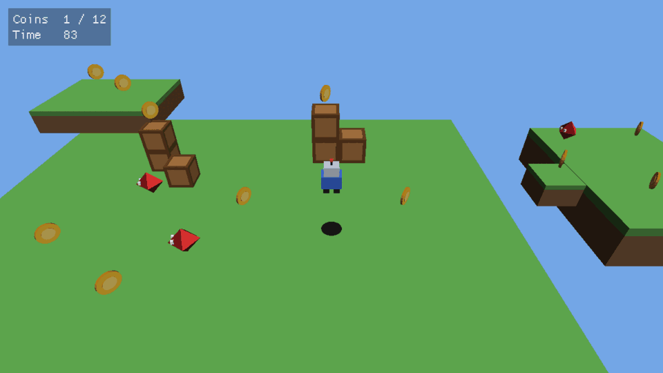

# Game Engine

A hobby 3D game engine in C++20 on SDL3, built to learn how engines work.
The design plan lives in the "Game Engine Design Plan" doc in the project.

Phases 1 and 2 are done. **Phase 1, Foundations** gave the engine a window, a
fixed-timestep game loop, a hand-written math library, action-based input, a
Dear ImGui debug panel, a small SDL_GPU renderer and CI on all three desktops.

**Phase 2, First 3D game** adds an entity-component system, collisions,
glTF models, Lua scripting and audio, all in service of *Coin Hunt*: run and
jump around two floating islands collecting twelve coins before the clock runs
out, while dodging patrolling diamonds. Its gate, *a small 3D game is
playable*, passes:



## Building

You need CMake 3.25+, git, and a C++20 compiler (Visual Studio 2022, Xcode 15,
or GCC 12 / Clang 16). Dependencies are fetched on the first configure.

```sh
cmake -S . -B build
cmake --build build
ctest --test-dir build        # unit tests
./build/bin/coin_hunt         # build\bin\Debug\coin_hunt.exe with Visual Studio
./build/bin/sandbox           # phase 1's moving cube
```

On Linux, SDL3 needs the X11/Wayland development packages listed in
`.github/workflows/ci.yml`.

**Coin Hunt controls:** WASD or arrows to move, Space to jump, R to restart,
F1 for the debug panel, F5 to reload the Lua script, Escape to quit. A
gamepad's left stick, A and Start buttons work too.

The game's rules are in `games/coin_hunt/scripts/`. Edit them while the game
runs and press F5 to see the change; `docs/scripting.md` lists everything a
script can call.

## Layout

```
engine/
  app.h/.cpp        the game loop; owns window, renderer, input, audio, debug UI
  core/
    fixed_step.h    the fixed-timestep accumulator
    log.h           logging macros
    math/           Vec3, Quat, Mat4, Transform; all written by hand
  world/            the sparse-set ECS, common components, shared systems
  physics/          sphere, box and ray tests; the character physics step
  assets/           glTF loading (via fastgltf) and the name -> asset table
  audio/            miniaudio wrapper with mixer buses and our own 3D falloff
  script/           Lua 5.4 (via sol2) and the engine API scripts see
  platform/         SDL3 window and the named-action input system
  render/           SDL_GPU renderer, meshes, HLSL shaders
  debug/            Dear ImGui hooked in as a renderer overlay
games/
  coin_hunt/        phase 2's game: C++ shell, Lua rules, models and sounds
  sandbox/          the test bed; phase 1's moving cube
tests/              doctest unit tests
tools/              compile_shaders.py, make_game_assets.py
docs/               scripting.md, the Lua API reference
```

Code only calls downward: games use `engine/`, and only `platform/`,
`render/` and `debug/` touch SDL. Game code never calls the GPU, and only
`engine/` .cpp files see fastgltf, miniaudio, Lua and sol2.

## How a frame works

`App::run()` in `engine/app.cpp` is the whole loop, and is short enough to read
in one sitting:

1. **Events.** SDL events go to ImGui and to `Input`, which maps keys and
   sticks to named actions like `move_x` and `jump`.
2. **Simulation.** `FixedStep` turns the real frame time into a number of
   exact 1/60 s steps (0, 1 or more) and the game's `fixed_update()` runs that
   many times. Gameplay is identical at 30 fps or 240 fps.
3. **Debug UI.** The game's `debug_ui()` builds ImGui panels.
4. **Render.** The game's `render()` gets `alpha`, how far real time is between
   the last two simulation steps, and draws objects blended by that much, so
   motion stays smooth even when frames and steps don't line up. The renderer
   then records a scene pass (with depth) and an overlay pass for ImGui, and
   submits them.
5. **Audio.** Sounds that finished playing are freed.

## How a step works in Coin Hunt

Everything in the game world is an entity in the ECS (`engine/world/ecs.h`):
an id with components such as `Transform`, `MeshRenderer`, `Collider` and
`Body` attached. Systems are plain functions run in a fixed order, which
`CoinHunt::fixed_update()` in `games/coin_hunt/main.cpp` spells out:

1. `save_previous_transforms()` remembers where everything was, so drawing can
   blend between steps.
2. The Lua script's `update(dt)` reads input and sets the player's velocity,
   moves the diamonds and runs the clock.
3. `Physics::step()` applies gravity, moves bodies, pushes them out of solid
   colliders (sliding along walls, landing on floors) and finds which bodies
   just walked into triggers.
4. Each trigger contact goes to the script's `on_trigger()`: a coin plays a
   sound and is destroyed, a diamond sends you back to the start.
5. `World::flush()` removes the entities the script destroyed.
6. The camera eases towards a point above and behind the player.

Drawing is `draw_meshes()`, which submits every entity with a mesh, plus a
blob shadow found by casting a ray down from each body.

The split is deliberate: C++ owns the order things happen in and everything
that has to be fast; Lua owns what the game is about. The level layout is in
`scripts/level.lua` and the rules in `scripts/game.lua`.

## Conventions worth knowing

* Right-handed coordinates, +Y up, the camera looks down -Z (same as glTF).
* Column vectors and column-major matrices: `p' = M * p`, and `A * B` applies
  `B` first. A model matrix is `translation * rotation * scale`.
* Clip space follows SDL_GPU: Y up, depth 0 (near) to 1 (far).
* Triangles wind counter-clockwise seen from the front; back faces are culled.

## Shaders

Shaders are HLSL in `engine/render/shaders/`. SDL_GPU doesn't compile shaders
at runtime, so `tools/compile_shaders.py` turns them into SPIR-V (Vulkan) and
Metal source, embedded in a generated header that is committed. You only need
the tools (`glslangValidator` and `spirv-cross`, both in the Vulkan SDK) when
you edit a shader.

For now Windows runs SDL_GPU's Vulkan backend. Moving to SDL_shadercross, as
the plan says, adds DXIL so Direct3D 12 works too.

## Status and notes

* Tested: builds warning-free with GCC 13 and Clang 18, all 51 unit tests
  pass, and Coin Hunt was played on Linux (Vulkan, software rendering) with
  real keyboard input: moving, jumping onto crates, collecting coins,
  falling off and respawning, and reloading a broken script with F5.
* Not yet run: macOS (Metal) and Windows. CI builds and tests both, but
  only a real machine shows the window. Sound was only checked to load and
  mix without errors; the test machine had no speakers.
* The models and sounds are made by `tools/make_game_assets.py` rather than
  Blender, so the repository needs no binary art tools. Any glTF file loads
  the same way.
* Changed from the plan: dependencies come from CMake FetchContent rather
  than vcpkg, so building needs nothing installed beyond CMake and git. Input
  bindings are set in code. The level is a Lua file for now; phase 3 brings
  JSON scene files. Scripts are one per game rather than one per entity,
  which is all Coin Hunt needed.
* Simplifications to revisit: collision boxes don't rotate, bodies only
  collide with static scenery (not each other), and fast objects could pass
  through thin walls (no swept tests). Jolt replaces all of this in phase 4.

Next is phase 3, *Workflow*: asset hot reload, proper asset handles, more
debug panels and Tracy profiling.
