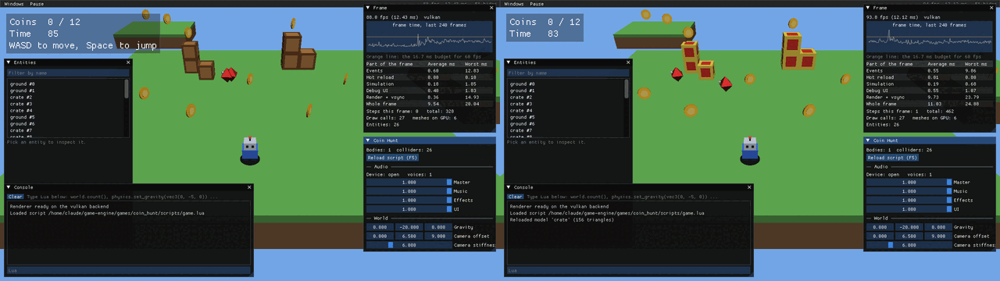

# Game Engine

A hobby 3D game engine in C++20 on SDL3, built to learn how engines work.
The design plan lives in the "Game Engine Design Plan" doc in the project.

Phases 1 to 3 are done. **Phase 1, Foundations** gave the engine a window, a
fixed-timestep game loop, a hand-written math library, action-based input, a
Dear ImGui debug panel, a small SDL_GPU renderer and CI on all three desktops.

**Phase 2, First 3D game** adds an entity-component system, collisions,
glTF models, Lua scripting and audio, all in service of *Coin Hunt*: run and
jump around two floating islands collecting twelve coins before the clock runs
out, while dodging patrolling diamonds. Its gate, *a small 3D game is
playable*, passes:


**Phase 3, Workflow** makes the engine quicker to work with. Assets are
reference-counted handles that reload themselves when their files change,
F1 opens debug tools (a frame-time graph, an entity inspector, an asset list
and a Lua console), and the loop is instrumented for the Tracy profiler. Its
gate, *edit a model and see it in-game*, passes: below, the crate model was
re-exported while the game ran, and the crates changed within a second with
nothing restarted.



## Building

You need CMake 3.25+, git, and a C++20 compiler (Visual Studio 2022, Xcode 15,
or GCC 12 / Clang 16). Dependencies are fetched on the first configure.

```sh
cmake -S . -B build
cmake --build build
ctest --test-dir build        # unit tests
./build/bin/coin_hunt         # build\bin\Debug\coin_hunt.exe with Visual Studio
./build/bin/sandbox           # phase 1's moving cube
```

On Linux, SDL3 needs the X11/Wayland development packages listed in
`.github/workflows/ci.yml`.

**Coin Hunt controls:** WASD or arrows to move, Space to jump, R to restart,
F1 for the debug tools, F5 to reload the Lua script, Escape to quit. A
gamepad's left stick, A and Start buttons work too.

The game's rules are in `games/coin_hunt/scripts/`. Edit them while the game
runs and save: the level restarts with the new rules. `docs/scripting.md`
lists everything a script can call.

## Working on a game

Three tools from phase 3 shorten the edit, run, look loop.

**Hot reload.** Every model, sound and script the game loads is watched.
Save the file (export from Blender, re-run `tools/make_game_assets.py`, edit
a script) and the running game picks it up a moment later: models and sounds
are swapped in place, and scripts restart the level. A broken save keeps the
last good version and shows the error in the Assets window until the next
save fixes it. Hot reload is on by default; configure with
`-DENGINE_HOT_RELOAD=OFF` to build without it, as packaged games will.

**Debug tools (F1).** Available in every game, from the engine:

* *Frame*: a graph of the last 240 frame times against the 16.7 ms budget,
  and a table of where the time goes (events, hot reload, simulation, UI,
  rendering). Pause freezes the simulation and Step advances it one tick.
* *Entities*: every entity in the world. Pick one to see its components and
  edit them live: move it, rotate it, change its model or tint, make it a
  trigger. Games add their own components to the inspector with one call.
* *Assets*: loaded models and sounds with their reference counts, reload
  counts and errors, and a Reload button.
* *Console*: the engine log, and a line that runs Lua in the game's script,
  e.g. `world.find("player"):teleport(vec3(0, 5, 0))`. Up and down recall
  earlier lines.

**Profiling with Tracy.** Configure with `-DENGINE_PROFILE=ON`, run the
game, and open the Tracy viewer (from the
[Tracy releases](https://github.com/wolfpld/tracy/releases), version
0.14.1 to match). It connects to the game and shows every frame as a
timeline of named zones: events, simulation, physics, the Lua update,
drawing, rendering. Add your own with `PROFILE_SCOPE("name")` from
`engine/core/profile.h`. With profiling off the macros compile to nothing.

## Layout

```
engine/
  app.h/.cpp        the game loop; owns window, renderer, input, audio, assets,
                    debug tools
  core/
    fixed_step.h    the fixed-timestep accumulator
    log.h           logging macros
    profile.h       PROFILE_* macros for Tracy
    math/           Vec3, Quat, Mat4, Transform; all written by hand
  world/            the sparse-set ECS, common components, shared systems
  physics/          sphere, box and ray tests; the character physics step
  assets/           handles, the reference-counted asset table, file watching
                    and hot reload; glTF loading (via fastgltf)
  audio/            miniaudio wrapper with mixer buses and our own 3D falloff
  script/           Lua 5.4 (via sol2) and the engine API scripts see
  platform/         SDL3 window and the named-action input system
  render/           SDL_GPU renderer, meshes, HLSL shaders
  debug/            Dear ImGui as a renderer overlay; the F1 tools, component
                    inspector and log capture
games/
  coin_hunt/        phase 2's game: C++ shell, Lua rules, models and sounds
  sandbox/          the test bed; phase 1's moving cube
tests/              doctest unit tests
tools/              compile_shaders.py, make_game_assets.py
docs/               scripting.md, the Lua API reference
```

Code only calls downward: games use `engine/`, and only `platform/`,
`render/` and `debug/` touch SDL. Game code never calls the GPU, and only
`engine/` .cpp files see fastgltf, miniaudio, Lua and sol2. Tracy is reached
only through `core/profile.h`.

## How a frame works

`App::run()` in `engine/app.cpp` is the whole loop, and is short enough to read
in one sitting:

1. **Events.** SDL events go to ImGui and to `Input`, which maps keys and
   sticks to named actions like `move_x` and `jump`.
2. **Hot reload.** `Assets::update()` checks the watched files (four times a
   second) and reloads any that changed.
3. **Simulation.** `FixedStep` turns the real frame time into a number of
   exact 1/60 s steps (0, 1 or more) and the game's `fixed_update()` runs that
   many times. Gameplay is identical at 30 fps or 240 fps. While paused, no
   steps run.
4. **Debug UI.** The engine's debug tools, if open, then the game's
   `debug_ui()` for its HUD and own panels.
5. **Render.** The game's `render()` gets `alpha`, how far real time is between
   the last two simulation steps, and draws objects blended by that much, so
   motion stays smooth even when frames and steps don't line up. The renderer
   then records a scene pass (with depth) and an overlay pass for ImGui, and
   submits them.
6. **Audio.** Sounds that finished playing are freed.

Each part is timed for the Frame window and wrapped in a Tracy zone.

## How assets work

A game loads each file once and keeps the `Handle<Model>` or `Handle<Sound>`
it gets back (`engine/assets/assets.h`). A handle is an index and a
generation, not a pointer, the same idea as ECS entity ids, so it stays safe
to hold after the asset is freed or reloaded. Loading a file that's already
loaded adds a reference to the same asset; `release()` drops one and the last
release frees the GPU buffers or decoded audio.

Components hold asset handles too: a `MeshRenderer` names a model, not a GPU
mesh. When a model's file changes, `Assets` reads it again and the renderer
replaces the mesh's buffers under the same handle, so every entity drawing
that model shows the new one on the next frame.

## How a step works in Coin Hunt

Everything in the game world is an entity in the ECS (`engine/world/ecs.h`):
an id with components such as `Transform`, `MeshRenderer`, `Collider` and
`Body` attached. Systems are plain functions run in a fixed order, which
`CoinHunt::fixed_update()` in `games/coin_hunt/main.cpp` spells out:

1. `save_previous_transforms()` remembers where everything was, so drawing can
   blend between steps.
2. The Lua script's `update(dt)` reads input and sets the player's velocity,
   moves the diamonds and runs the clock.
3. `Physics::step()` applies gravity, moves bodies, pushes them out of solid
   colliders (sliding along walls, landing on floors) and finds which bodies
   just walked into triggers.
4. Each trigger contact goes to the script's `on_trigger()`: a coin plays a
   sound and is destroyed, a diamond sends you back to the start.
5. `World::flush()` removes the entities the script destroyed.
6. The camera eases towards a point above and behind the player.

Drawing is `draw_meshes()`, which submits every entity with a model, plus a
blob shadow found by casting a ray down from each body.

The split is deliberate: C++ owns the order things happen in and everything
that has to be fast; Lua owns what the game is about. The level layout is in
`scripts/level.lua` and the rules in `scripts/game.lua`.

## Conventions worth knowing

* Right-handed coordinates, +Y up, the camera looks down -Z (same as glTF).
* Column vectors and column-major matrices: `p' = M * p`, and `A * B` applies
  `B` first. A model matrix is `translation * rotation * scale`.
* Clip space follows SDL_GPU: Y up, depth 0 (near) to 1 (far).
* Triangles wind counter-clockwise seen from the front; back faces are culled.

## Shaders

Shaders are HLSL in `engine/render/shaders/`. SDL_GPU doesn't compile shaders
at runtime, so `tools/compile_shaders.py` turns them into SPIR-V (Vulkan) and
Metal source, embedded in a generated header that is committed. You only need
the tools (`glslangValidator` and `spirv-cross`, both in the Vulkan SDK) when
you edit a shader.

For now Windows runs SDL_GPU's Vulkan backend. Moving to SDL_shadercross, as
the plan says, adds DXIL so Direct3D 12 works too.

## Status and notes

* Tested: builds warning-free with GCC 13 and Clang 18, all 65 unit tests
  pass, and Coin Hunt was played on Linux (Vulkan, software rendering) with
  real keyboard input: moving, jumping onto crates, collecting coins,
  falling off and respawning, and reloading a broken script with F5. For
  phase 3: re-exporting the crate model while the game ran, and the debug
  tools (picking and editing entities, Lua in the console, pause and step).
  The tests and the game also ran clean under AddressSanitizer. With
  `ENGINE_PROFILE=ON`, Tracy's command-line capture tool recorded all the
  zones over six seconds of play; the graphical viewer wasn't opened.
* Not yet run: macOS (Metal) and Windows. CI builds and tests both, but
  only a real machine shows the window. Sound was only checked to load and
  mix without errors; the test machine had no speakers.
* The models and sounds are made by `tools/make_game_assets.py` rather than
  Blender, so the repository needs no binary art tools. Any glTF file loads
  the same way.
* Changed from the plan: dependencies come from CMake FetchContent rather
  than vcpkg, so building needs nothing installed beyond CMake and git. Input
  bindings are set in code. Scripts are one per game rather than one per
  entity, which is all Coin Hunt needed. The level is still a Lua file:
  JSON scene files, which the phase 2 notes expected here, are left for
  later, since a Lua level already reloads on save. Assets load on the main
  thread rather than a worker; Coin Hunt's load in well under a second.
* Hot reload watches files by checking their modification times four times
  a second rather than with each OS's change notifications. It is simple,
  works the same everywhere, and costs a few microseconds per file.
* Simplifications to revisit: collision boxes don't rotate, bodies only
  collide with static scenery (not each other), and fast objects could pass
  through thin walls (no swept tests). Jolt replaces all of this in phase 4.

Next is phase 4, *Look and feel*: PBR materials, shadow maps, skinned
animation, and Jolt in place of the hand-written physics.
