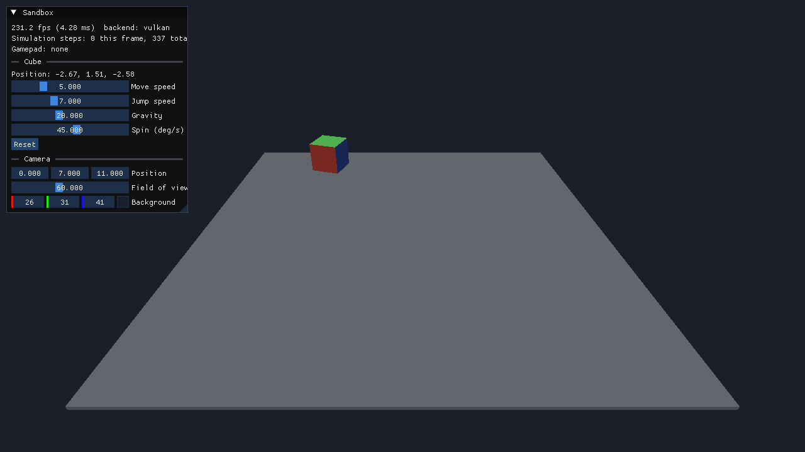

# Game Engine

A hobby 3D game engine in C++20 on SDL3, built to learn how engines work.
The design plan lives in the "Game Engine Design Plan" doc in the project.

This is **phase 1, Foundations**: a window, a fixed-timestep game loop, a
hand-written math library, action-based input, a Dear ImGui debug panel, a
small SDL_GPU renderer and CI on all three desktops. Its gate, *a cube moves
with the keyboard*, passes:



## Building

You need CMake 3.24+, git, and a C++20 compiler (Visual Studio 2022, Xcode 15,
or GCC 12 / Clang 16). Dependencies are fetched on the first configure.

```sh
cmake -S . -B build
cmake --build build
ctest --test-dir build        # unit tests
./build/bin/sandbox           # build\bin\Debug\sandbox.exe with Visual Studio
```

On Linux, SDL3 needs the X11/Wayland development packages listed in
`.github/workflows/ci.yml`.

**Sandbox controls:** WASD or arrows to move, Space to jump, R to reset,
Escape to quit. A gamepad's left stick and A button work too.

## Layout

```
engine/
  app.h/.cpp        the game loop; owns window, renderer, input, debug UI
  core/
    fixed_step.h    the fixed-timestep accumulator
    log.h           logging macros
    math/           Vec3, Quat, Mat4, Transform; all written by hand
  platform/         SDL3 window and the named-action input system
  render/           SDL_GPU renderer, meshes, HLSL shaders
  debug/            Dear ImGui hooked in as a renderer overlay
games/sandbox/      the test bed; phase 1's moving cube
tests/              doctest unit tests
tools/              compile_shaders.py
```

Code only calls downward: games use `engine/`, and only `platform/`,
`render/` and `debug/` touch SDL. Game code never calls the GPU.

## How a frame works

`App::run()` in `engine/app.cpp` is the whole loop, and is short enough to read
in one sitting:

1. **Events.** SDL events go to ImGui and to `Input`, which maps keys and
   sticks to named actions like `move_x` and `jump`.
2. **Simulation.** `FixedStep` turns the real frame time into a number of
   exact 1/60 s steps (0, 1 or more) and the game's `fixed_update()` runs that
   many times. Gameplay is identical at 30 fps or 240 fps.
3. **Debug UI.** The game's `debug_ui()` builds ImGui panels.
4. **Render.** The game's `render()` gets `alpha`, how far real time is between
   the last two simulation steps, and draws objects blended by that much, so
   motion stays smooth even when frames and steps don't line up. The renderer
   then records a scene pass (with depth) and an overlay pass for ImGui, and
   submits them.

## Conventions worth knowing

* Right-handed coordinates, +Y up, the camera looks down -Z (same as glTF).
* Column vectors and column-major matrices: `p' = M * p`, and `A * B` applies
  `B` first. A model matrix is `translation * rotation * scale`.
* Clip space follows SDL_GPU: Y up, depth 0 (near) to 1 (far).
* Triangles wind counter-clockwise seen from the front; back faces are culled.

## Shaders

Shaders are HLSL in `engine/render/shaders/`. SDL_GPU doesn't compile shaders
at runtime, so `tools/compile_shaders.py` turns them into SPIR-V (Vulkan) and
Metal source, embedded in a generated header that is committed. You only need
the tools (`glslangValidator` and `spirv-cross`, both in the Vulkan SDK) when
you edit a shader.

For now Windows runs SDL_GPU's Vulkan backend. Moving to SDL_shadercross, as
the plan says, adds DXIL so Direct3D 12 works too.

## Status and notes

* Tested: builds warning-free with GCC 13, all 15 unit tests pass, and the
  sandbox was run on Linux (Vulkan, software rendering) with real keyboard
  input to check moving, jumping and quitting.
* Not yet run: macOS (Metal) and Windows. CI builds and tests both, but
  only a real machine shows the window.
* Changed from the plan: dependencies come from CMake FetchContent rather
  than vcpkg, so building needs nothing installed beyond CMake and git. Input
  bindings are set in code; a config file can load into the same `bind_*`
  calls later.

Next is phase 2, *First 3D game*: glTF meshes, your own ECS, your own
collisions, Lua and audio.
